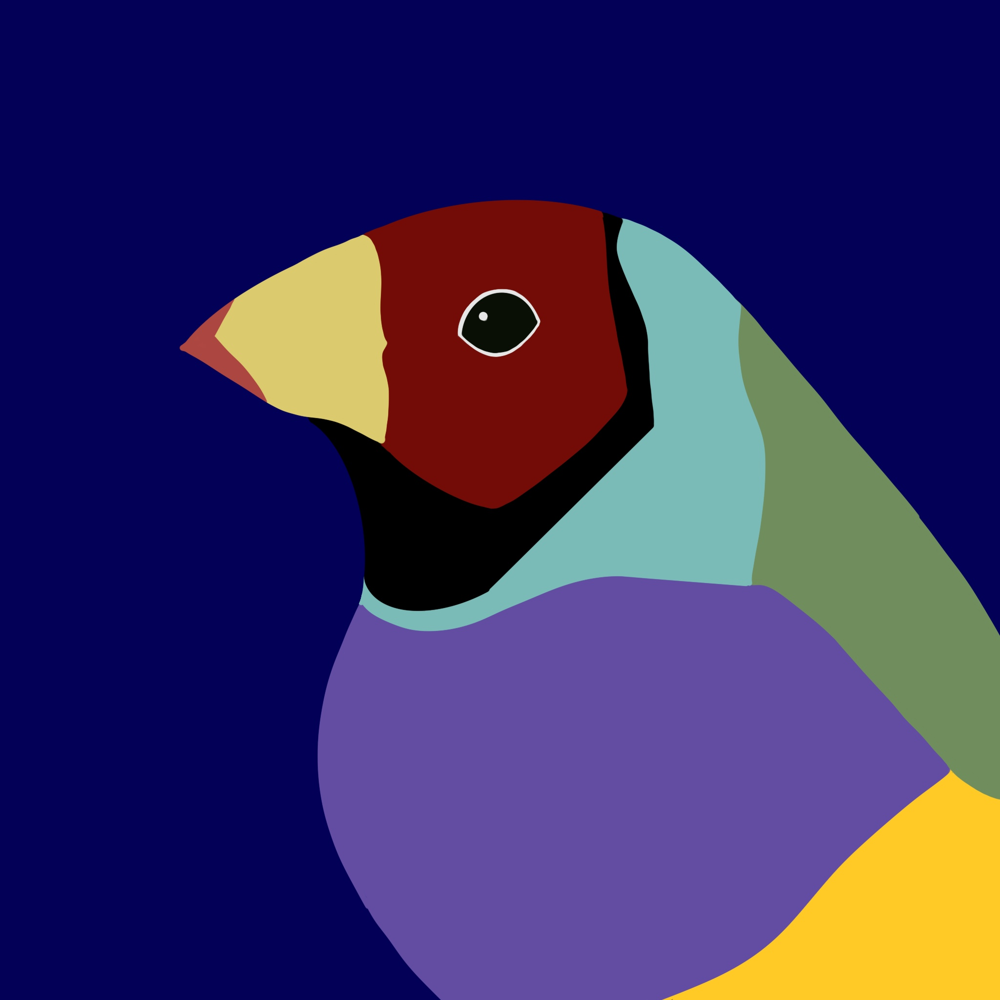
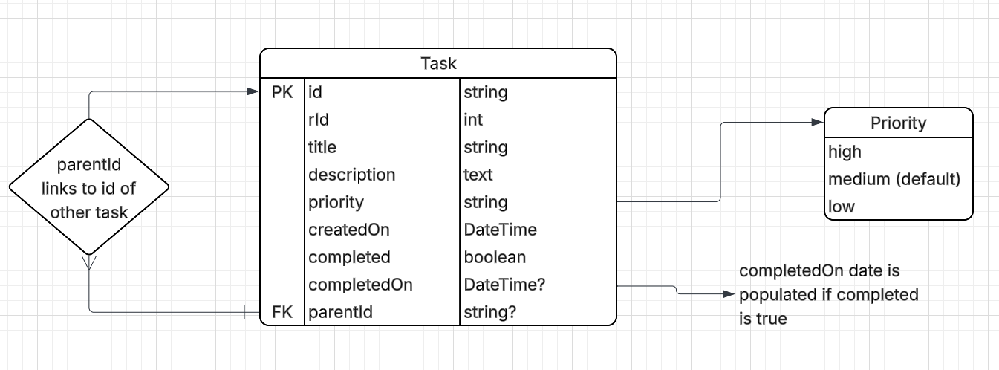
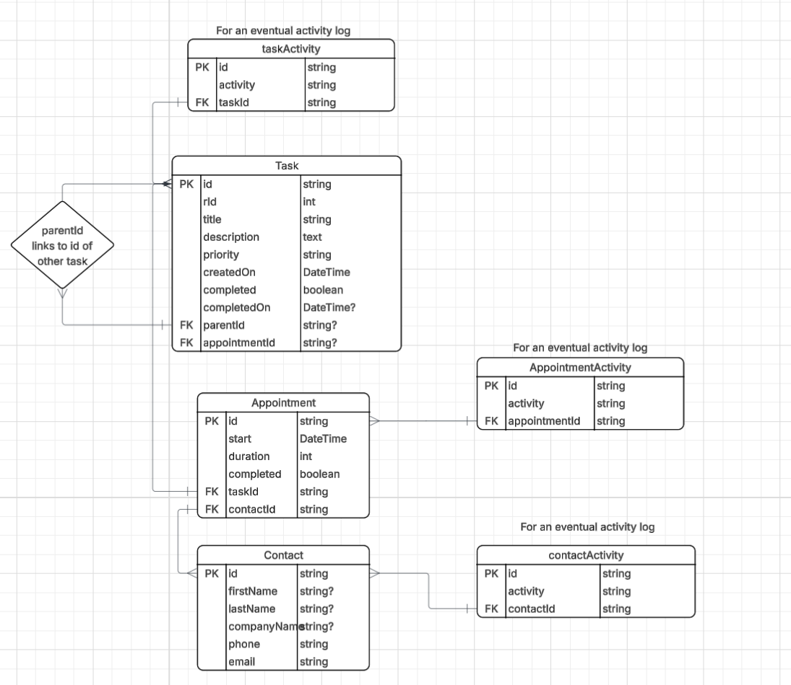

# task_finch

Task Finch is a task todo list application with infinite nesting.

--- 

I always got sick of how Jira and other projects make it so difficult to have nesting layers:

Sometimes subtasks end up more fragmented than we intend, or there's a lot to keep track of.

... or there's suddenly an intermediate layer where one task ends up having linked sister tasks, and there's no way to keep them together in a large epic.

If I could just nest tasks, and swap out the parent for a set of tasks, it would solve all my problems.

--- 

Then, when using personal todo apps, it feels like it can be quite difficult to have nested lists at all.

Most checkbox lists allow for one single level of checkboxes, with no extra customisation. 

For example, getting ready for a trip and having an item to "pack" - I need to note what to pack, and there might be washing included in that setup. 

"Pack" is deceptively simple for this task. But the other option is usually to have "pack socks", "pack shirts", "pack pants" in amongst your unrelated tasks - "charge devices", "organise visa" and "print itinerary".

The solution to me was to create a todo list with the same priorities, titles and descriptions - but to allow this infinite nesting. 

---

Task Finch is starting out with a simple design, where tasks simply can assign a parent - which is another task. This can be done in editing or in adding a task.

This means the layout is simple (since really every task with a parent renders the same way) and the DB structure (since it's really only one table with an FK linking to itself). 

However, it does lead to some logic problems that will need to be solved as part of this:

## Logic problems

### What happens when completing or deleting a task with child tasks?

This is perhaps the most obvious problem. 
However, I think the ideal solution is to 

a) show for each task that it has child tasks - make it clear to the user that the task isn't just standalone, and

b) if the user chooses to complete the task, knowing it has child tasks, give the user a set of options - do they want to:

- complete all subtasks
- assign the top level tasks to a new parent, with the rest of the structure remaining the same
- remove the parent of the top-level tasks and have them be top-level (or the next level up, if the parent in question has a parent), or 
- cancel and manually adjust for each task. 

This prevents the user from being blindsided by random tasks being completed, but keeps the flexibility of moving tasks around seamlessly. 

### What happens if, somehow, a task links to itself?

In the bulk editing scenario, a task that is assigned itself should _not_ update its parent id to itself.

The only way to avoid this entirely would be to remove any selected tasks from the parent field. This feels like it's not very user friendly, as missing tasks may cause confusion and would make the app harder to use.

This is a more complicated question, however, and I'm still thinking through the possibilities:

- In a scenario where the parent is being completed: where task A is being completed and task B and task C are being assigned to task B: assign task C to task B, then assign task B to either task A's parent (if it exists) or have task B be a top level task (if it doesn't). This would need to alert the user.

- In a standard bulk-edit scenario, where task A, B, C and D are being assigned to task A - assign all other tasks to task A, and leave task A as is. 

### How do you stop the user from flattening the structure, such as assigning multiple layers of tasks to a new parent?

You don't! That's the whole point of the app - to allow the user flexibility when re-assigning and moving tasks. This is one of the main reason a task is just that - a task, with no inherent hierarchical structure. 

Obviously it's not good for users if they do it accidentally - ideally we would show the user an alert message if they're in the process of doing this. 

But sometimes tasks are _smaller_ than you think, and you decide to group multiple levels of tasks together under 1 parent. This should be possible for the user. 

--- 

Eventual plan:

- Add activity log
- Add appointments that can be linked to tasks
    - Potentially we can also have contacts here - e.g. call Joe Plumber

