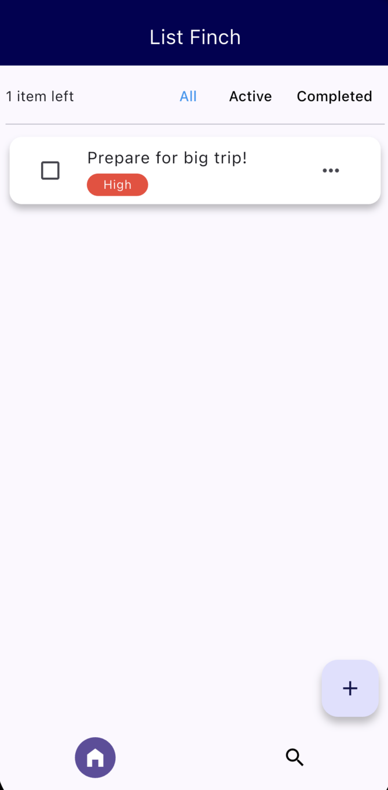

# Progress update 20/10/2025

The base functionality is done!
It is possible to edit, add and delete tasks, assign them a priority, and assign them a parent. 

All subtasks are rendered inside their parent task's detail page. 

There is a Home button for easy navigation (and an unimplemented search). The colours are inspired by the ListFinch logo (yet to be added to the app.)

---

## Screenshots

### Home screen: 

The home screen shows only top level tasks (i.e. tasks with no parent). This is to keep the home screen uncluttered and easy to focus on.

--- 

### Add tasks:

The add task dialog is simple but provides everything you need to create a task - including the option to add a parent task.
This allows you to slot a task into any layer of the task tree - or even make a new one.

---

### Task detail when empty

Tasks don't _need_ to have subtasks - in fact, all they need is a title and a priority (of Low, Medium or High).
This is an example of a task with no subtasks.

---

### Task detail with subtask list

This is once subtasks have been added to the same task, and they display in a subtask list. 

This shows how you can navigate down to subtasks, as they're hidden in the home page (which only shows top level tasks).
You can add as many subtasks as you want to each task. 

---

### Deeper task detail page

This shows how you can continuously extend downward - where `Pack all clothes` can have multiple subtasks ... 
and each of those can have multiple subtasks.

---