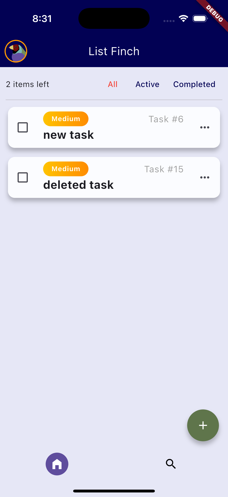
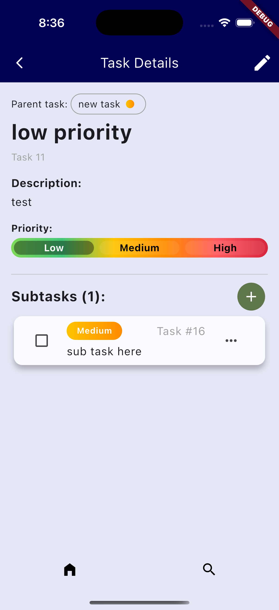
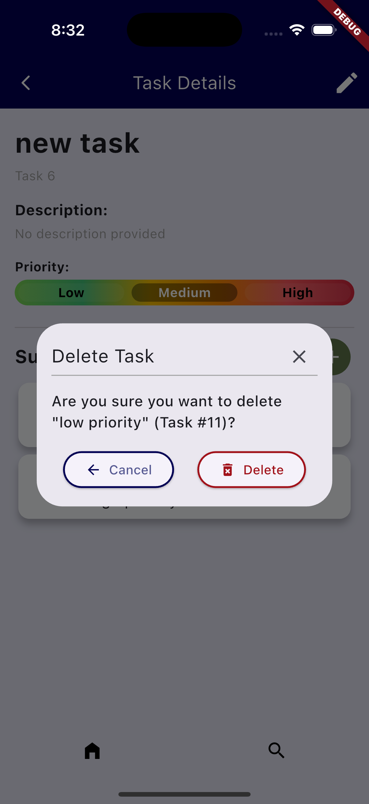
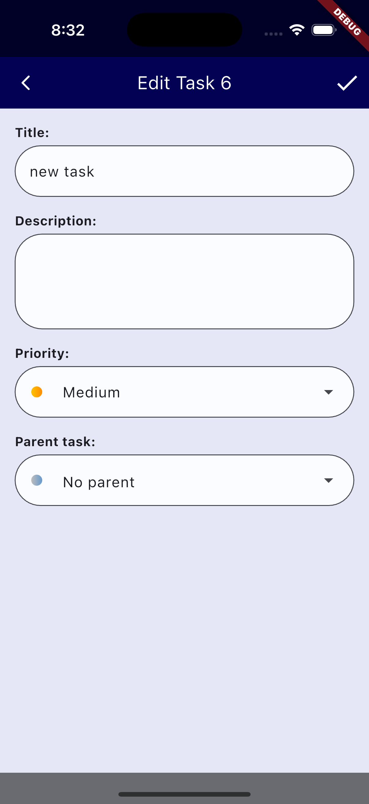

# Progress update 23/10/2025

Recent developments have been largely styling related recently.

The home cards, and especially the task detail screen have been reworked.
This is taking some inspiration from the generated designs, and some tweaking for usability.

The forms still need some work, though ... that'll be next along with some extra functionality.

---

## Screenshots

### Home screen: 

The home screen shows only top level tasks (i.e. tasks with no parent). This is to keep the home screen uncluttered and easy to focus on.

---

### Home

The home cards have been split into their own cards and all cards now show a task number.
This is because users are allowed to enter tasks of the same name - this is to help tell them apart.

### Task detail

Particularly to my liking is the new priority indicator on the detail screen.

This page has been reworked a fair bit since last time.
The parent task is more obviously clickable

The extra 'Add Subtask' button has also been removed.

---

### Confirm Delete

One of the additions is the confirm delete dialog.
When using the app I often found myself deleting tasks by accident and wanted a confirmation for something so intense.

Also since the last update, if a parent task is deleted, we now automatically unassign any subtask.
This is step 1 of the deletion process - the intent is to eventually have users decide what they want with the subtasks for deleted parents.

### Edit Task

The forms still need work - I find they lack the refinement of the other pages.

Editing is now its own dialog with a specific state and order, which helps with readability.

